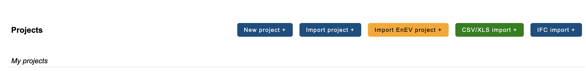

# eLCA Parameter Sensitivity Analysis Tool

**Status:** Research prototype developed as part of a Bachelor's thesis at RWTH
Aachen University. The tool depends on the live [eLCA](https://www.bauteileditor.de)
web application and has primarily been validated on template-based building
components; see [Known Limitations](#6-a-few-things-worth-knowing) below. The source
code is licensed under [MIT](LICENSE).

This tool tests how a building element's parameters (thickness, quantity, service
lifetime, etc.) affect its total GWP (Global Warming Potential) in [eLCA](https://www.bauteileditor.de),
and lets you try out alternative values before committing to a design decision.

It works by automating a real browser. It changes a parameter on the actual eLCA
website, reads back the resulting GWP, resets the value, and moves on to the next one.

## What this tool gives you

Beyond the raw numbers, the tool tells you what they mean. Each parameter's response
gets classified as linear or non-linear, with a plain-language interpretation of what
that shape implies for the design decision at hand (worth double-checking, safe to
ignore, offset by another stage, and so on). Response curves, side-by-side parameter
comparisons, and an additivity check for combined changes are all built in, so you can
see and explore results before deciding anything, not just get a single number back.

## Quick Start

1. Get the project files (see Installation below). Don't have Python or Chrome yet?
   See [1. What you need](#1-what-you-need) for download links.
2. Create a virtual environment (recommended).
3. `pip install -r requirements.txt`
4. `streamlit run app.py`
5. Enter your eLCA credentials and connect to a building element.

The sections below cover every step of this in more detail, plus what to expect
and what to do if something goes wrong.

**New to this tool? See [5. First-time walkthrough](#5-first-time-walkthrough)
below before using it on your own project.**

---

## Setting Up the Tool

## 1. What you need

- **Python 3.9 or newer** ([download it here](https://www.python.org/downloads/) if you don't have it)
- **Google Chrome** ([download it here](https://www.google.com/chrome/) if you don't
  have it) installed. The tool opens and controls a real Chrome window on its own.
- **An eLCA account** with access to the project you want to analyze. eLCA is free, so
  register at [bauteileditor.de](https://www.bauteileditor.de) if you don't have one yet.
  This tool has only been tested against template-based components, not fully custom
  ones built from scratch. See [5. First-time walkthrough](#5-first-time-walkthrough)
  for how to add one.
- **A stable internet connection**

**Tested environment:** Python 3.13, Google Chrome 151, and the package versions
pinned as minimums in `requirements.txt` (Streamlit 1.57, pandas 3.0, numpy 2.4,
matplotlib 3.10, BeautifulSoup 4.14, Selenium 4.45). Older versions may still
work but haven't been verified.

## 2. Opening a terminal

- **Mac**: Spotlight (Cmd + Space) → type "Terminal" → Enter
- **Windows**: Windows key → type "Command Prompt" or "PowerShell" → Enter
- **Linux**: Ctrl + Alt + T, or open your distro's terminal app from the applications menu

## 3. Installation

1. If you don't have Python or Chrome yet, download them first:
   [Python](https://www.python.org/downloads/), [Google Chrome](https://www.google.com/chrome/).
2. Get the tool onto your computer, either way works:
   - **Download as ZIP**: go to the [GitHub repository](https://github.com/kultugce/elca-tool),
     click **Code → Download ZIP**, then unzip it.
   - **Or clone it with git**:
     ```
     git clone https://github.com/kultugce/elca-tool.git
     ```
   Either way, the folder should contain at least `app.py`,
   `full_sensitivity_analysis.py`, and `requirements.txt`.

3. In the terminal, navigate into it, e.g.:
   ```
   cd Desktop/elca-tool-main
   ```
   (The folder is named `elca-tool-main` if you downloaded the ZIP, or `elca-tool`
   if you cloned it with git; adjust the path if you renamed or moved it.)

   If `cd` doesn't find the folder, it's usually a wrong or misspelled path. As an
   alternative, open the unzipped folder in your file explorer, then right-click
   inside it and choose **"Open in Terminal"** (Windows 11) or, in the folder's own
   window, **Shift + right-click → "Open PowerShell window here"** (Windows 10) /
   right-click → **"New Terminal at Folder"** (Mac Finder) / **"Open Terminal Here"**
   (most Linux file managers, e.g. Nautilus, Dolphin).

4. (Recommended) Create a virtual environment, so the tool's packages stay separate from
   everything else on your computer:

   Run each command below one at a time: paste the first line, press Enter, wait for
   it to finish, then paste the next line. Pasting several lines at once can send them
   to the terminal all together and cause errors.

   **Mac / Linux**
   ```
   python3 -m venv venv
   ```
   ```
   source venv/bin/activate
   ```
   On some Linux distributions (e.g. Ubuntu/Debian), the first command fails with a
   message about `ensurepip` unless the venv module is installed separately first:
   ```
   sudo apt install python3-venv
   ```
   then run the two commands above again.

   **Windows (Command Prompt)**
   ```
   python -m venv venv
   ```
   ```
   venv\Scripts\activate
   ```

   **Windows (PowerShell)**
   ```
   python -m venv venv
   ```
   ```
   Set-ExecutionPolicy -Scope Process -ExecutionPolicy Bypass
   ```
   PowerShell will ask if you want to change the execution policy. Type `Y` (or `A`
   for "Yes to All", same result here) and press Enter.
   ```
   venv\Scripts\Activate.ps1
   ```

   Either way, you'll see `(venv)` appear at the start of the terminal line once
   it's active.

5. Install the dependencies:
   ```
   pip install -r requirements.txt
   ```
   Nothing needs to be installed for Chrome separately. `selenium` handles that itself
   the first time it runs.

## 4. Running it

Same terminal, same folder:

```
streamlit run app.py
```

The first time you ever run Streamlit on your computer, it may ask for an email
address before starting. This is normal, just press Enter to skip it.

**Important:** analyses are slow (see below), so make sure your computer won't fall
asleep while it's running. On Mac, start with `caffeinate -i streamlit run app.py`
instead of the plain command above. On Windows and Linux, turn off sleep/screen-lock
for the time being:

- **Windows**: Settings → System → Power & sleep → set both "Screen" and "Sleep" to
  "Never" (temporarily, just for the run).
- **Linux**: depends on your desktop environment, but generally Settings → Power
  (GNOME) or Settings → Power Management (KDE) → disable automatic suspend and
  screen lock.

Your browser opens automatically at `http://localhost:8501`. Keep the terminal window
open in the background while you work.

**To stop the tool**, press `Ctrl+C` in the terminal, or just close the terminal window.

**To use it again later**, open a terminal in this folder, activate the virtual
environment if you made one (`source venv/bin/activate` on Mac/Linux,
`venv\Scripts\activate` on Windows Command Prompt, or `venv\Scripts\Activate.ps1`
on PowerShell), and run `streamlit run app.py` again. That's it, no need to repeat
the installation steps or anything else from above.

---

## Using the Tool

## 5. First-time walkthrough

Try the tool on a simple template element before using it on your own project, from
creating it in eLCA through reading the first results, a low-stakes example before
it's your real building data.

1. Log into your eLCA account at [bauteileditor.de](https://www.bauteileditor.de).
   Don't have one yet? Registration is free, use the same page.
2. In eLCA, create a test project: **Projects → New project**.

   

3. Open **Building constructions → 330 Exterior walls/vertical structures, exterior**,
   then click **+ New building element From template**.

   

4. Search for and pick a simple template, e.g. **"Außenwand / einschaliges
   Mauerwerk / erdberührt"**, an eLCA system template. Depending on your project's
   material database, it may not show up; any similarly simple wall template works
   just as well.

   

5. Copy the link to the new element. eLCA's navigation goes Building → Building
   Construction → individual Building Element ("Module"); copy the link to that
   individual element/module page, which looks like `.../project-elements/1234567/`.
   A link to the overall Building or Building Construction page won't work, but a
   link to one of the element's own sub-elements works too, if you only want to
   analyze that part on its own.
6. Back in the tool, enter your eLCA username and password, paste the link, and
   click **Connect & Load Component**.

   

   - A popup asks you to confirm you've read a short safety note. Click **"I've read
     and accept - Connect"** to proceed.
   - A real Chrome window then opens and logs into eLCA on its own. **Don't click,
     type, scroll, or close it once it's open**, even if it looks idle, one accidental
     click can interrupt the run mid-value. Minimize it right after it appears; the
     tool doesn't need it visible.
   - If you added a material or layer yourself (not from the original template), make
     sure it isn't left highlighted red in eLCA first. Red means eLCA considers the row
     incomplete and silently excludes it from every calculation, so both eLCA's own
     numbers and this tool's results would be missing that material's contribution.
   - **Connect & Load Component** stays disabled while a background analysis is
     already running elsewhere, since it would reuse the same Chrome window. It
     re-enables once that run finishes.
7. Pick a parameter or two and start the Full Analysis. The tool goes through them
   one at a time. Full Analysis, Calculate New GWP, and Run Additivity Check all show
   a **⏹ Stop** button while running; it waits for the parameter currently being tested
   to finish its own read/write/reset cycle before actually stopping, so nothing is
   left half-changed.
8. Once it finishes, the summary table fills in (example below is from a different,
   more complex element, to show what a fuller result set looks like):

   

   Click any row (or pick one from the dropdown above it) to inspect it in detail:

   

9. Curious how a few parameters stack up against each other? **Compare multiple
   parameters**, below the summary table, overlays up to 8 parameter curves on one
   chart.

   

10. Want to try a value without committing to it? Open **Parameter Explorer**, change
    one or more fields, and click **Calculate New GWP**. Whatever you change is reset
    in eLCA automatically afterward, even if something fails partway through; use
    **↺ Reset to baseline values** to put every field back to its real starting value.

    

11. Changed more than one value? A **Run Additivity Check** button appears under "Do
    parameters interact?". It tells you whether the effects simply add up or partly
    cancel/compound each other when changed together.

    

That's the full loop, including trying out your own scenarios.

### Reading the results

**Inspect a parameter** opens once you click any row in that table (or pick one from
the dropdown above it). It shows the parameter's full response curve, three summary
metrics (GWP range, relative range, and whether the shape is linear or non-linear),
and a "What do these results mean?" section with the generated plain-language
interpretation, life-cycle stage breakdown, and any cross-parameter comparisons that
apply. A **Raw data** expander underneath has the exact numbers behind the chart.

The number in parentheses next to a parameter name (e.g. "Wall (2) - Insulation -
thickness (mm)") identifies which part of the element it belongs to. Nested sub-parts
get their own numbering, starting again from 1.

The colored boxes under each result are sorted by how much they matter: **green** =
good news / safe to not worry about it, **purple** = neutral, worth knowing, **amber** =
worth your attention. A plain gray dashed box is just a small UI hint, not a result.

## 6. A few things worth knowing

### Performance and running

This is slow on purpose: every tested value is a real interaction with the eLCA website,
so a full run can take minutes to hours. You don't need to keep this browser tab in
focus, minimize it instead of closing it and it keeps running in the background, as
long as the terminal stays open and the computer doesn't sleep. Streamlit's spinner
(top-right) confirms it's still running.

The **⋮** menu (top-right) has Streamlit's own defaults (theme, **Print** to save as PDF,
**Record screen**); ignore **Deploy**. Avoid **Clear cache** and the **Stop** button next
to Deploy while a run is active, both can make the app lose track of what it's doing
mid-step.

**Run only one analysis at a time.** Since it's the same eLCA account, running more than
one at once, even in different tabs or projects, can mix up the results.

### Credentials and data safety

**Credentials:** your username and password live only in this session's memory, used
solely to log into eLCA. They're never written to disk or logged anywhere, and are
cleared the moment you close the terminal.

Every value the tool changes gets reset back to its original state automatically, even if
a run fails partway through, everywhere in the tool, not just Parameter Explorer.

### Caching

**Results are cached** on your own computer, in `~/.elca_sensitivity_cache/` (one file
per element, named `<project ID>_<element ID>.json`), so reopening an element later reuses
what's already been tested instead of re-running it. The cache belongs to the computer,
not your eLCA login, so anyone else using the same machine sees the same cached results.
Its folder name starts with a dot, which some file managers hide by default:

- **Mac (Finder)**: Cmd+Shift+G, then type `~/.elca_sensitivity_cache`
- **Windows (File Explorer)**: paste `%USERPROFILE%\.elca_sensitivity_cache` into the
  address bar
- **Linux**: Ctrl+H in your file manager to show hidden folders, or open
  `~/.elca_sensitivity_cache` directly in a terminal

To reset one element, delete its matching `.json` file.

**If you change something on eLCA's own website directly** (not through this tool) for an
element you've already analyzed, use **Re-analyze** to pick up the new value. If results
still look off afterward, delete that element's cache file (above) and reconnect for a
completely clean slate.

### Known limitations

- A few deeply nested layer parameters can occasionally fail to read. This is rare and
  safe: you'll see a clearly labeled "failed" parameter, not a wrong number.
- Element names sometimes show up in German instead of English: this tool only
  translates names it already knows. A new or unfamiliar template name just shows up as
  eLCA wrote it.

## 7. If something goes wrong

### Connecting

- **"Could not connect / load component"**: check if `bauteileditor.de` opens normally
  in a regular browser tab. If it doesn't, it's your connection or eLCA, not this tool.
- **"The Chrome window closed before connecting finished"**: click **Connect & Load
  Component** again and leave the window open and untouched until it finishes.
- **Chrome window seems frozen**: don't click inside it. If it's genuinely stuck,
  `Ctrl+C` in the terminal, close the window, and start again.

### During an analysis run

- **A parameter shows up as "failed"**: re-run just that one from the parameter picker,
  it's isolated and won't affect anything else.
- **Full Analysis (overnight/unattended)** retries automatically on an expired eLCA
  login or a dropped connection. If a parameter is still failed afterward, re-run it
  manually from the parameter picker.
- **Parameter Explorer errors after a long idle session**: click **Disconnect**, then
  **Connect & Load Component** again (cached results are unaffected), and try again.

### eLCA won't save / validation messages

- **An added material/layer seems to have no effect, or the baseline GWP looks too
  low**: check that row in eLCA. If it's still highlighted red, eLCA considers it
  incomplete and excludes it from calculations. Fix it, save in eLCA, then select all
  parameters and **Re-analyze**.
- **"...has 'Own' selected for its useful life but no reason typed in"**: open the layer
  in eLCA, type any text under "Useful lives", save, and reconnect.
- **"...still has a custom ('Own') lifetime with the reason 'sensitivity analysis'"**:
  a leftover marker from an interrupted run, not a value you set. Switch it back to
  standard in eLCA (or edit the reason if intentional), then reconnect.

Anything not covered here shows up in the app's own error messages, which are written to
explain what happened and what to check next.

## 8. How it's built

```
Streamlit UI (app.py)
        |
        v
Analysis logic: shape classification, interpretation text, caching (app.py)
        |
        v
Selenium browser automation (full_sensitivity_analysis.py)
        |
        v
eLCA web application (bauteileditor.de)
```

- **`app.py`**: the Streamlit interface: session state, the on-disk result cache,
  the German-to-English name translations, chart rendering, and all of the
  plain-language interpretation text.
- **`full_sensitivity_analysis.py`**: everything that actually talks to eLCA
  through Selenium: logging in, discovering a component's parameters, and
  reading/writing/resetting individual values.

Every number shown anywhere in the tool is read directly from eLCA through this
chain, never computed or estimated independently.

## Academic Context

This software was developed as part of the Bachelor's thesis *"User-Centered
Automation of Parameter Sensitivity Analysis in eLCA"*, submitted to the chair
for Software and Tools for Computational Engineering (STCE) at RWTH Aachen
University.

**Author:** Tuğçe Kul
**Year:** 2026
